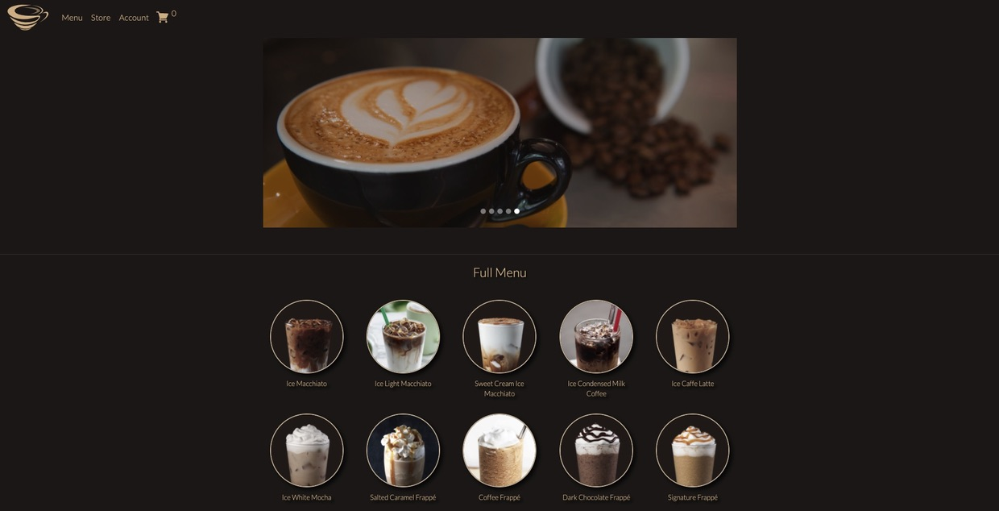
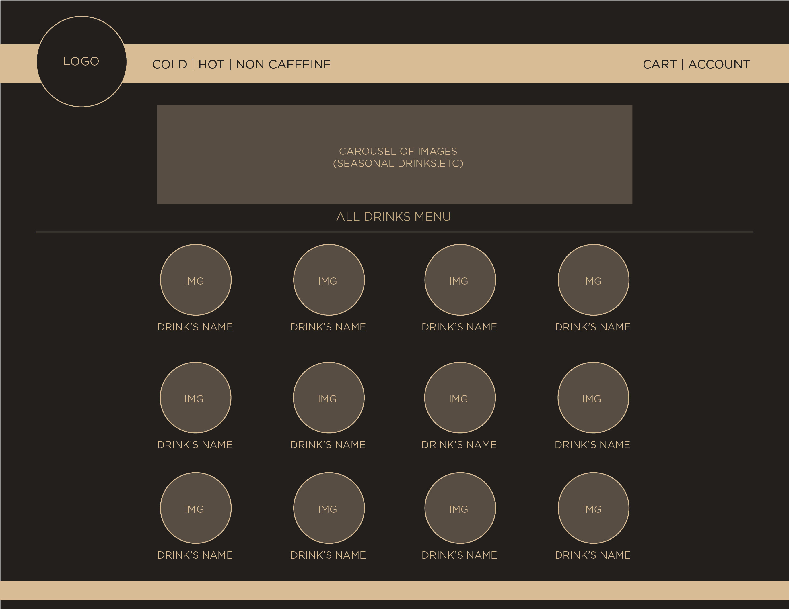
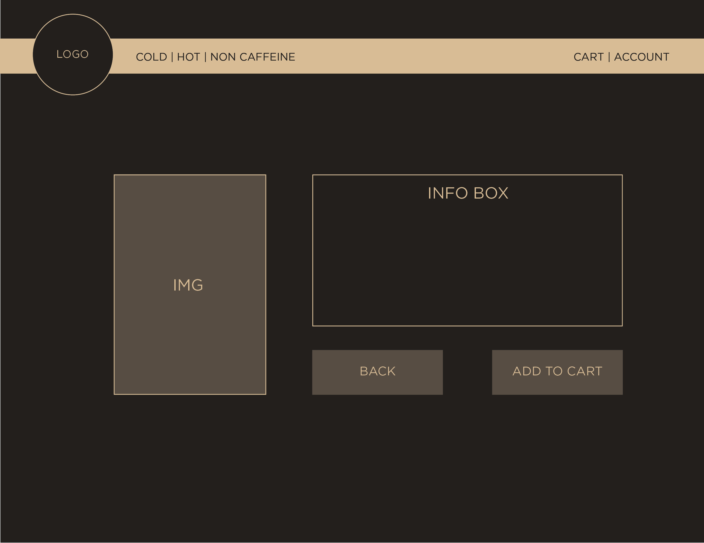
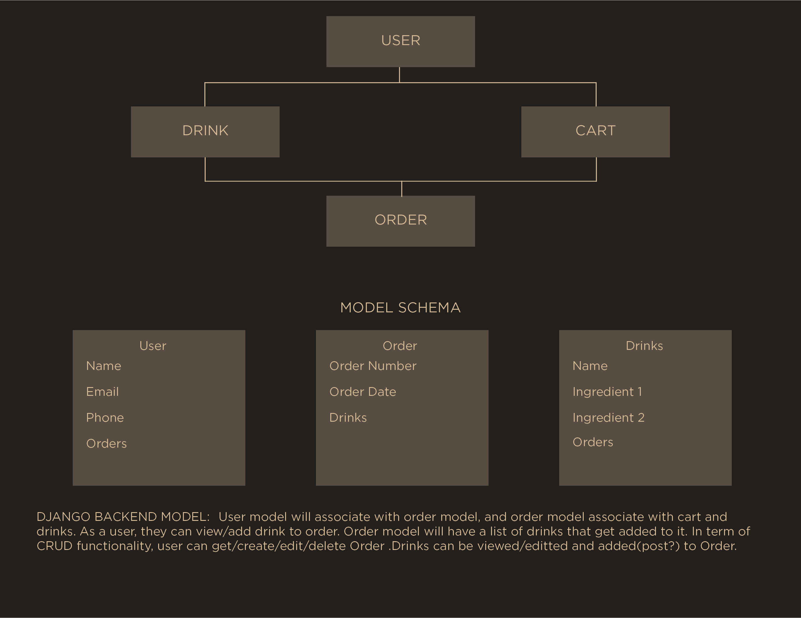
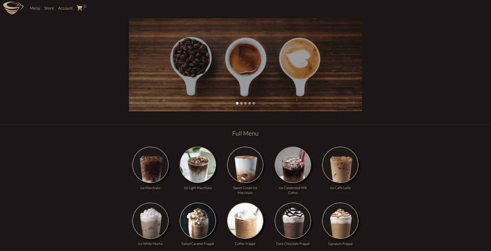
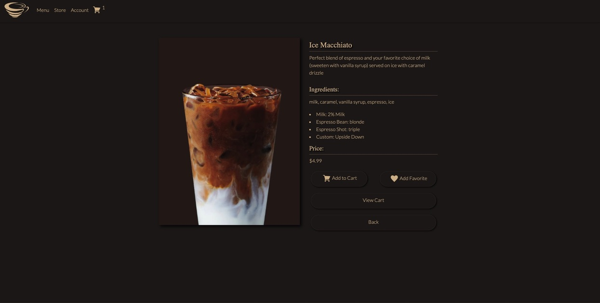
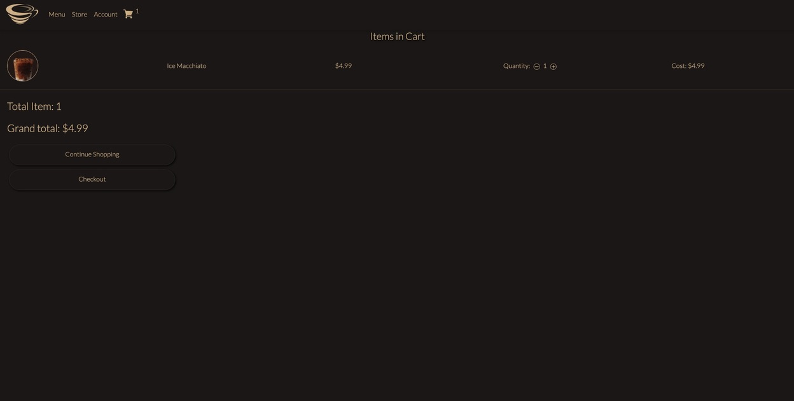
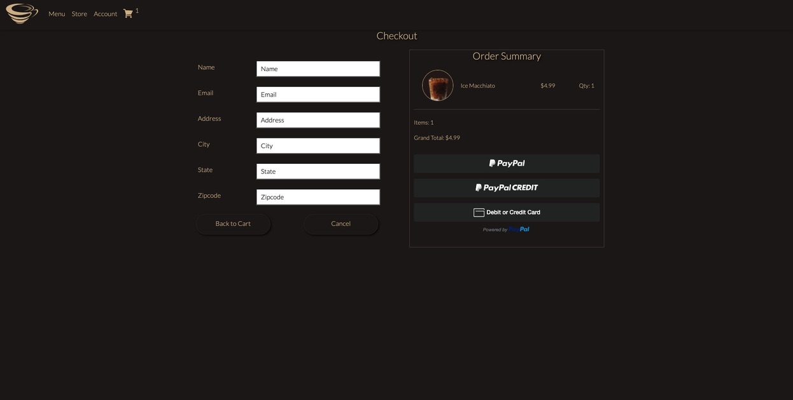

## About the Project
[Swirl](https://swirl-project.herokuapp.com/) is an e-commerce website focusing on customer facing and B2C sales of espresso special drinks

## SWIRL


## User Stories
This website is for coffee and espresso lovers who love to have their drinks made by a skillful barista. However, it's hard for people to go outside, make a trip to their nearby stores and grab their drinks because of the Covid19 lockdown. Therefore, Swirl focused on letting people order their drink and have it deliver to their home. User friendly interfaces with minimal page transitions, users can order drinks and have them deliver to their home as fast as few clicks. Users don't need to Sign-up for an account to order drinks, they can simply add their drinks of choice and proceed to payment. Using PayPal or cards (majors credit cards accepted), users can order their drinks and not worry about having to go to stores.

## Installation and Usage
[The website](https://swirl-project.herokuapp.com/) is up and running, no addition installation is needed. It's built with Django and Python for backend, Javascripts, Django template, CSS and MDBootstrap for front end. In case you want to have this project on your local machine and try different things, you can fork and clone this repo, install necessary dependencies, activate virtual environment with ```pipenv shell``` and run server with ```python3 manage.py runserver``` The website will be running on ```localhost 8000```

## Planning and Wireframing
I started this project with a rough idea in mind then quickly created the wireframe for the first couple pages of the website using Indesign and Photoshop. 

### Homepage


### Detail page


Then I planned out how to build my backend models with simple structure of what the model would look like and what information it should contain

### Back-End Model Structure



After having a solid idea about the backend model and their relationships, I built out the backend with Django and simply rendered each routes with Django template to make sure each routes/endpoint displayed correctly. I built full C.R.U.D functionality and and tested each endpoint with Postman.

## Technology Used
HTML5 - semantic structure for view templates <br>
CSS3 - styling for static file, utilized flexbox and grid <br>
Javascript - DOM manipulation, event listener and handler <br>
Python - Logic for backend functions <br>
Django - View templates, Django allauth for Sign-up and Sign-in, REST API framework (for React front end) <br>
Bootstrap/MDBootstrap - Fade-in animation <br>
Adobe CC - Planning, Wireframe, Images, Logo, Icons <br>
PayPal - Payment handle with PayPal API <br>
Google Map API - Stores and near by location <br>

## Challenges and Overcome Obstacles
There were few problems along the way when building this project, first because I tried to build the website so users can add their drinks, view their current cart items and checkout without having to Sign-up for an account, I planned on using cookies for storing those data, created a ```cart``` cookie, persist it and retrieve it to render its property were challenge. It took me few tries and youtube tutorial to get it right. <br>

Then user authentication is another challenge, I used Django allauth to handle signup and signin, so the form and function is already built out, but require user authentication with csrf-token took me a lot of trial and error. Styling with pre-made form from Django-allauth is another obstacle that I have to overcome, it made me better at CSS

## Code sample
Since users don't have to signup for an account to order, I have to find a way to track which order belong to which customer, so at the checkout page, users would need to fill out some information for the backend to accept the order

```javascript
let form = document.getElementById('form')
function submitFormData(){
	let userFormData = {
		'name':form.name.value,
		'email': form.email.value,
		'total':total
	}
	let shippingInfo = {
		'address': form.address.value,
		'city': form.city.value,
		'state': form.state.value,
		'zipcode': form.zipcode.value,
	}
	let url = '/process_order/'
	fetch(url,{
		method:'POST',
		headers:{
			'Content-Type': 'application/json',
			'X-CSRFToken':csrftoken,
		},
		body:JSON.stringify({'form':userFormData, 'shipping': shippingInfo})
	}).then((response)=>response.json()).then((data)=>{
		alert('Transaction Complete!');
		cart ={}
		document.cookie = 'cart=' +JSON.stringify(cart) + ';domain=;path=/'
		window.location.href = ""
	})

}
```
and users submit their forms during Paypal payment processing

```javascript
let total = '{{order.get_cart_total}}'
	paypal.Buttons({
		style:{
			color:'black'
		},
		createOrder: function (data, actions) {
			// This function sets up the details of the transaction, including the amount and line item details.
			return actions.order.create({
				purchase_units: [{
					amount: {
						value: parseFloat(total).toFixed(2)
					}
				}]
			});
		},
		onApprove: function (data, actions) {
			// This function captures the funds from the transaction.
			return actions.order.capture().then(function (details) {
				// This function shows a transaction success message to your buyer.
				submitFormData()
			});
		}
    }).render('#paypal-button-container');    
```

## Quick Review Of The Website

### Homepage


### Detail Page



### Cart



### Checkout



Thank you for reading!
